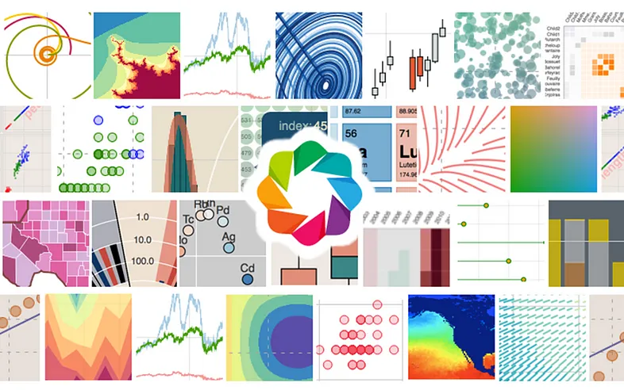

# Interactive Data Visualization with Bokeh


<p align="center">
  
  
  
  
  
  
  
  
  
</p>

Welcome to the **Interactive Data Visualization with Bokeh** project! This project showcases a collection of interactive visualizations created using the Bokeh library, which is known for its ability to produce high-quality, interactive plots and dashboards in Python.

## 📚 Project Overview

This repository contains various examples and tutorials on how to leverage Bokeh to create interactive data visualizations. Bokeh is a powerful library for building visually appealing and interactive plots that are well-suited for data exploration and presentation.


### Features

- **📈 Line Plots**: Create line charts to visualize data trends over time.
- **🔵 Scatter Plots**: Plot data points to reveal relationships and distributions.
- **🔶 Hexbin Plots**: Visualize density of data points using hexagonal bins.
- **🖼️ Image & Image RGBA Plots**: Generate grayscale and color images from data matrices.
- **🔍 Interactive Charts**: Add interactivity to charts with tools such as hover and zoom.
- **📊 Bokeh Datasets**: Work with built-in datasets to create insightful visualizations.

## 🛠️ Technologies Used

- **Bokeh**: A Python library for creating interactive plots and dashboards.
- **NumPy**: A library for numerical computations and data manipulation.

## 📦 Installation

To use the code in this repository, you need to install the required libraries. You can do this using pip:

```bash
pip install bokeh numpy 
```
# 📂 Cloning the Repository
You can clone this repository to your local machine using the following command:


```bash
git clone https://github.com/yyigitturan/Interactive-Data-Visualization-With-Bokeh.git
```


# 🔍 Usage
After cloning the repository and installing the required libraries, you can explore the various examples and tutorials provided in the project. Each example demonstrates a different aspect of Bokeh's capabilities for creating interactive visualizations.


